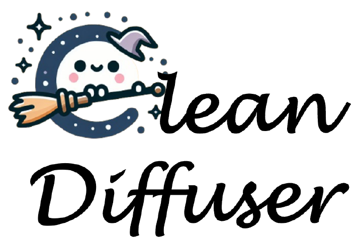
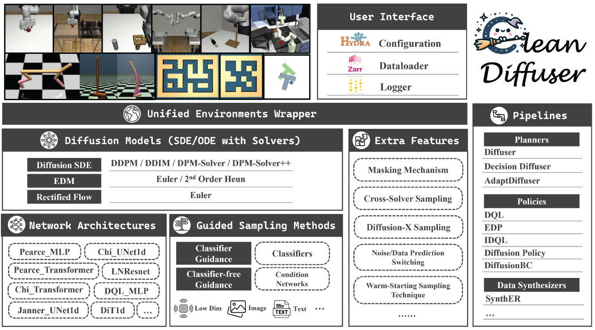

# CleanDiffuser: An Easy-to-use Modularized Library for Diffusion Models in Decision Making

·
<a href="">ArXiv</a>
·
<a href="">Ducomentation</a>
·
<a href="">Colab</a>
·

**CleanDiffuser** is an easy-to-use modularized Diffusion Model library tailored for decision-making, which comprehensively integrates different types of diffusion algorithmic branches. CleanDiffuser offers a variety of advanced *diffusion models*, *network structures*, diverse *conditions*, and *algorithm pipelines* in a simple and user-friendly manner. Inheriting the design philosophy of [CleanRL](https://github.com/vwxyzjn/cleanrl) and [Diffusers](https://github.com/huggingface/diffusers), CleanDiffuser emphasizes **usability, simplicity, and customizability**. We hope that CleanDiffuser will serve as a foundational tool library, providing long-term support for Diffusion Model research in the decision-making community, facilitating the application of research for scientists and practitioners alike. The highlight features of CleanDiffuser are:

- 🚀 Amazing features specially tailored for decision-making tasks
- 🍧 Support for multiple advanced diffusion models and network architectures
- 🧩 Build decoupled modules into integrated pipelines easily like building blocks
- 📈 Wandb logging and Hydra configuration
- 🌏 Unified environmental interface and efficient dataloader

We strongly recommend reading the [paper]() and [documents]() to learn more about CleanDiffuser and its design philosophy.

